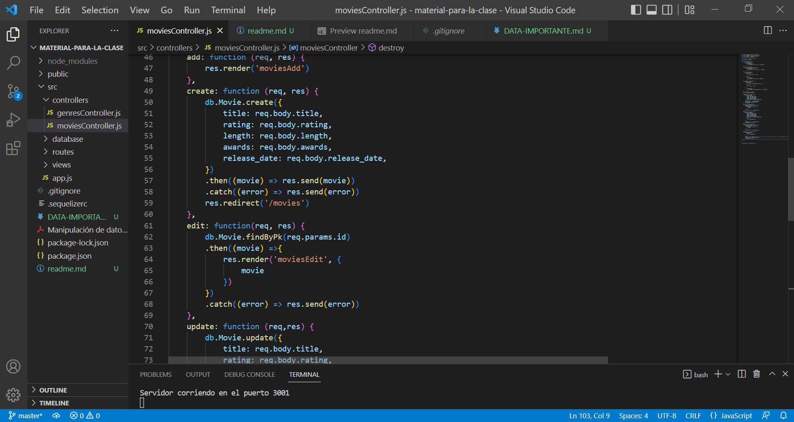

### Manipulación de datos 📚📚
#### Al trabajar con MySQL existe la posibilidad de crear, actualizar y borrar registros de una base de datos.
#### Estas mismas tareas también son posibles de realizar dentro de Sequelize. 
####  👉 ¿Pero que es Sequelize? 👈
#### Es algo asi como un puente, una herramienta que nos provee node js para conectarnos con una base de datos.
#### A diferencia de MySQL, en Sequelize para modificar un registro tendremos que usar el método update() y para borrarlo el método destroy(). El create sigue siendo lo mismo en los dos casos, solo que dentro de Sequelize para crear un registro deberás usar el método create().
#### En esta práctica, manipularemos nuestra base de datos con el ORM Sequelize, haciendo nuestro primero CRUD completo, con esta herramienta.
